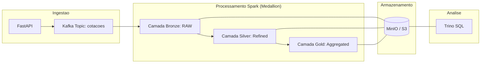

# Data Pipeline - Ingestão de Dados Ativos B3

Este projeto demonstra um pipeline de dados em tempo real utilizando a API da Brapi, Kafka, Spark Streaming, Delta Lake, MinIO e Trino.

---

## 🛠️ Requisitos e Tecnologias
- **Docker & Docker Compose**
- **Git Bash** (recomendado para Windows)
- **Tecnologias**: FastAPI, Kafka, Spark 3.5, Delta Lake, MinIO, Trino.

---

## 📊 Fluxo de Dados (Arquitetura Medallion)



---

## 🖥️ Dashboards de Monitoramento

Após iniciar o pipeline, você pode acompanhar o status em tempo real através destes links:

| Serviço | URL de Acesso | Objetivo |
| :--- | :--- | :--- |
| **MinIO Console** | [http://localhost:9001](http://localhost:9001) | Verificar arquivos `.parquet` e logs Delta. |
| **Spark Master** | [http://localhost:8080](http://localhost:8080) | Acompanhar aplicações Spark "Running". |
| **Spark Worker** | [http://localhost:8081](http://localhost:8081) | Verificar uso de CPU/RAM das tasks. |
| **FastAPI Docs** | [http://localhost:8000/docs](http://localhost:8000/docs) | Testar a ingestão manualmente. |

---

## 🚀 Guia de Execução Passo a Passo

Siga esta ordem exata para garantir que todas as camadas sejam criadas e fiquem visíveis no Trino.

### 1. Reset Total (Sempre comece aqui para evidências limpas)
Limpe todos os dados, volumes do MinIO/Kafka e metadados do Trino:
```bash
cd app
./reset_pipeline.sh
```

### 2. Iniciar o Pipeline
```bash
./start_pipeline.sh
```
*Aguarde o script finalizar. Ele abrirá o console do MinIO (porta 9001) automaticamente.*

### 3. Aguardar a Inicialização das Camadas
**Importante:** O Trino só consegue enxergar as tabelas após o Spark criar os logs do Delta Lake no MinIO.
- **Aguarde de 2 a 3 minutos** após o script terminar.
- Verifique no MinIO (`http://localhost:9001`) se as pastas `bronze`, `silver` e `gold` já possuem a subpasta `_delta_log`.

---

## 🔍 Consultando Dados no Trino

### 1. Acessar o CLI do Trino
```bash
docker exec -it app-trino-1 trino
```

### 2. Registrar as Tabelas (Obrigatório após cada Reset)
Execute os comandos abaixo na ordem. 

⚠️ **Atenção:** Se você tentar registrar cedo demais, o Trino retornará um erro dizendo que o caminho não existe. 
**Solução:** Se falhar, aguarde mais um minuto e tente o comando `CALL` novamente.

```sql
-- Criar os esquemas
CREATE SCHEMA IF NOT EXISTS delta.bronze;
CREATE SCHEMA IF NOT EXISTS delta.silver;
CREATE SCHEMA IF NOT EXISTS delta.gold;

-- Registrar as tabelas (Se falhar, aguarde os logs aparecerem no MinIO e repita)
CALL delta.system.register_table(schema_name => 'bronze', table_name => 'cotacoes', table_location => 's3a://datalake/bronze/cotacoes');
CALL delta.system.register_table(schema_name => 'silver', table_name => 'cotacoes', table_location => 's3a://datalake/silver/cotacoes');
CALL delta.system.register_table(schema_name => 'gold', table_name => 'media_precos_5min', table_location => 's3a://datalake/gold/media_precos_5min');
```

---

## 📊 Relatórios e Métricas (Pasta `/queries`)

O diretório `app/queries/` contém os scripts necessários para extrair as evidências finais do seu TCC:

1.  **`relatorio_tcc_metricas.sql`**:
    *   Contém queries SQL prontas para serem executadas no Trino.
    *   **Uso**: Copie e cole os comandos para validar volume de dados, latência entre camadas e integridade dos preços.
2.  **`metrics_analysis.py`**:
    *   Script Python para análise de dados e geração de visualizações.
    *   **Uso**: Após coletar dados por algum tempo, execute este script para gerar insights sobre o desempenho do pipeline.

---

## 📈 Configurações para TCC (Alta Estabilidade)
O ambiente foi configurado para suportar execuções longas (24h+):
- **Spark Worker**: 4GB RAM.
- **Drivers/Executors**: 1GB RAM por camada.
- **Persistência**: Checkpoints automáticos no MinIO para recuperação de falhas.

---
*Documentação organizada para suporte ao TCC e apresentações técnicas.*
