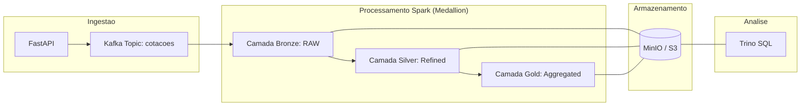

# Data Pipeline - Ingestão de Dados Ativos B3

Este projeto demonstra um pipeline de dados em near real time para cotações de ativos B3 utilizando a API da Brapi, Kafka, Spark Structured Streaming, Delta Lake, MinIO e Trino.

O processamento é contínuo, mas a latência fim a fim depende também da fonte de dados. Durante o desenvolvimento será usada a Brapi Free, com dados defasados. Para a coleta final de evidências do TCC, a estratégia recomendada é contratar temporariamente a Brapi Pro, que reduz o atraso aproximado das cotações para 5 minutos.

---

## 🛠️ Requisitos e Tecnologias
- **Docker & Docker Compose**
- **Git Bash** (recomendado para Windows)
- **Tecnologias**: FastAPI, Kafka, Spark 3.5, Delta Lake, MinIO, Trino.

---

## 📊 Fluxo de Dados (Arquitetura Medallion)



---

## 🖥️ Dashboards de Monitoramento

Após iniciar o pipeline, você pode acompanhar o status operacional através destes links:

| Serviço | URL de Acesso | Objetivo |
| :--- | :--- | :--- |
| **MinIO Console** | [http://localhost:9001](http://localhost:9001) | Verificar arquivos `.parquet` e logs Delta. |
| **Spark Master** | [http://localhost:8080](http://localhost:8080) | Acompanhar aplicações Spark "Running". |
| **Spark Worker** | [http://localhost:8081](http://localhost:8081) | Verificar uso de CPU/RAM das tasks. |
| **FastAPI Docs** | [http://localhost:8000/docs](http://localhost:8000/docs) | Testar a ingestão manualmente. |

---

## 🚀 Guia de Execução Passo a Passo

Siga esta ordem exata para garantir que todas as camadas sejam criadas e fiquem visíveis no Trino.

### 1. Reset Total (Sempre comece aqui para evidências limpas)
Limpe todos os dados, volumes do MinIO/Kafka e metadados do Trino:
```bash
cd app
./reset_pipeline.sh
```

### 2. Iniciar o Pipeline
```bash
./start_pipeline.sh
```
*Aguarde o script finalizar. Ele sobe todos os serviços via Docker Compose, executa os testes Spark no container e abre o console do MinIO (porta 9001) automaticamente.*

Se houver token da Brapi disponível, configure antes de iniciar o Docker Compose:
```bash
export BRAPI_TOKEN=seu_token
export MARKET_DATA_POLL_INTERVAL_MINUTES=5
```

Sem `BRAPI_TOKEN`, o pipeline usa o acesso gratuito da Brapi. Para desenvolvimento isso é suficiente, mas as evidências finais devem registrar a limitação de atualização da fonte.

Também é possível criar um arquivo `.env` a partir do modelo:

```bash
cp .env.example .env
```

Principais configurações:

| Variável | Objetivo | Padrão |
| :--- | :--- | :--- |
| `BRAPI_TOKEN` | Token da Brapi Free/Pro. | vazio |
| `MARKET_DATA_POLL_INTERVAL_MINUTES` | Intervalo do scheduler. | `5` |
| `MARKET_DATA_TICKERS` | Lista de ativos coletados, separada por vírgula. | `PETR4,VALE3,ITUB4,BBAS3,MGLU3` |
| `KAFKA_TOPIC` | Tópico Kafka usado pela API e pelo Spark Bronze. | `cotacoes` |
| `MINIO_ACCESS_KEY` | Usuário do MinIO/S3 local. | `admin` |
| `MINIO_SECRET_KEY` | Senha do MinIO/S3 local. | `admin123` |
| `DATA_LAKE_BUCKET` | Bucket usado para Bronze, Silver, Gold e checkpoints. | `datalake` |

API FastAPI e scheduler são serviços conteinerizados no `docker-compose.yml`. A API publica mensagens no Kafka usando `KAFKA_BOOTSTRAP_SERVERS=kafka:29092`, e o scheduler chama a API pela rede interna em `http://api:8000`.

### 3. Aguardar a Inicialização das Camadas
**Importante:** O Trino só consegue enxergar as tabelas após o Spark criar os logs do Delta Lake no MinIO.
- **Aguarde de 2 a 3 minutos** após o script terminar.
- Verifique no MinIO (`http://localhost:9001`) se as pastas `bronze`, `silver` e `gold` já possuem a subpasta `_delta_log`.

---

## 🔍 Consultando Dados no Trino

### 1. Acessar o CLI do Trino
```bash
docker exec -it app-trino-1 trino
```

### 2. Registrar as Tabelas (Obrigatório após cada Reset)
Após as pastas `_delta_log` aparecerem no MinIO para Bronze, Silver e Gold, execute:

```bash
./register_trino_tables.sh
```

No Windows, também é possível usar:

```bat
register_trino_tables.bat
```

O script cria os schemas, registra as tabelas Delta e faz novas tentativas automaticamente caso o Spark ainda não tenha criado os logs Delta.

Referência dos comandos executados:

```sql
-- Criar os esquemas
CREATE SCHEMA IF NOT EXISTS delta.bronze;
CREATE SCHEMA IF NOT EXISTS delta.silver;
CREATE SCHEMA IF NOT EXISTS delta.gold;

-- Registrar as tabelas (Se falhar, aguarde os logs aparecerem no MinIO e repita)
CALL delta.system.register_table(schema_name => 'bronze', table_name => 'cotacoes', table_location => 's3a://datalake/bronze/cotacoes');
CALL delta.system.register_table(schema_name => 'silver', table_name => 'cotacoes', table_location => 's3a://datalake/silver/cotacoes');
CALL delta.system.register_table(schema_name => 'gold', table_name => 'media_precos_5min', table_location => 's3a://datalake/gold/media_precos_5min');
```

---

## 📊 Relatórios e Métricas (Pasta `/queries`)

O diretório `app/queries/` contém os scripts necessários para extrair as evidências finais do seu TCC:

1.  **`relatorio_tcc_metricas.sql`**:
    *   Contém queries SQL prontas para serem executadas no Trino.
    *   **Uso**: Copie e cole os comandos para validar volume de dados, latência entre camadas e integridade dos preços.
2.  **`metrics_analysis.py`**:
    *   Script Python para análise de dados e geração de visualizações.
    *   **Uso**: Após coletar dados por algum tempo, execute este script para gerar insights sobre o desempenho do pipeline.

---

## 📈 Configurações para TCC (Alta Estabilidade)
O ambiente foi configurado para suportar execuções longas (24h+):
- **Spark Worker**: 4GB RAM.
- **Drivers/Executors**: 1GB RAM por camada.
- **Persistência**: Checkpoints automáticos no MinIO para recuperação de falhas.

---

## 🎓 Estratégia de Defesa no TCC

Para manter a defesa tecnicamente correta, o trabalho deve usar a expressão **near real time** em vez de tempo real estrito. A arquitetura processa eventos de forma contínua, mas a atualização do preço depende da Brapi.

Plano adotado:

1. **Desenvolvimento com Brapi Free**: manter o custo zero enquanto o pipeline, os testes e a documentação são estabilizados.
2. **Coleta final com Brapi Pro**: contratar por um mês próximo da apresentação para coletar evidências com atraso aproximado de 5 minutos.
3. **Gold em janelas de 5 minutos**: alinhar a agregação final ao intervalo esperado para a coleta paga de evidências. A janela Gold é operacional e baseada em `ingestion_timestamp`, ou seja, mede o comportamento do pipeline por intervalo de ingestão; análises futuras por horário do pregão podem usar `event_timestamp`. A escrita da Gold usa modo `complete` para materializar o agregado atual durante a demonstração.
4. **Medição de latência fim a fim**: separar latência da fonte, latência de ingestão e latência de processamento entre Bronze, Silver e Gold.
5. **Trabalho futuro com WebSocket/Cedro**: registrar a integração com Market Data via WebSocket como evolução para dados efetivamente em tempo real, sem colocar essa dependência no caminho crítico da entrega.

Essa escolha reduz risco operacional na apresentação e mantém uma justificativa sólida de Engenharia de Dados: a arquitetura é streaming, enquanto a tempestividade dos dados é limitada pelo provedor contratado.

---
*Documentação organizada para suporte ao TCC e apresentações técnicas.*
