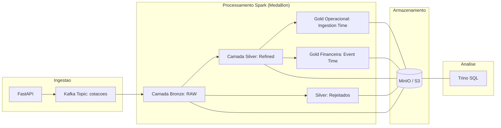

# Data Pipeline - Ingestão de Dados Ativos B3

Este projeto demonstra um pipeline de dados em near real time para cotações de ativos B3 utilizando a API da Brapi, Kafka, Spark Structured Streaming, Delta Lake, MinIO e Trino.

O processamento é contínuo, mas a latência fim a fim depende também da fonte de dados. Durante o desenvolvimento será usada a Brapi Free, com dados defasados. Para a coleta final de evidências do TCC, a estratégia recomendada é contratar temporariamente a Brapi Pro, que reduz o atraso aproximado das cotações para 5 minutos.

---

## 🛠️ Requisitos e Tecnologias
- **Docker & Docker Compose**
- **Git Bash** (recomendado para Windows)
- **Tecnologias**: FastAPI, Kafka, Spark 3.5, Delta Lake, MinIO, Trino.

---

## 📊 Fluxo de Dados (Arquitetura Medallion)



---

## 🖥️ Dashboards de Monitoramento

Após iniciar o pipeline, você pode acompanhar o status operacional através destes links:

| Serviço | URL de Acesso | Objetivo |
| :--- | :--- | :--- |
| **MinIO Console** | [http://localhost:9001](http://localhost:9001) | Verificar arquivos `.parquet` e logs Delta. |
| **Spark Master** | [http://localhost:8080](http://localhost:8080) | Acompanhar aplicações Spark "Running". |
| **Spark Worker** | [http://localhost:8081](http://localhost:8081) | Verificar uso de CPU/RAM das tasks. |
| **FastAPI Docs** | [http://localhost:8000/docs](http://localhost:8000/docs) | Testar a ingestão manualmente. |

---

## 🚀 Guia de Execução Passo a Passo

Siga esta ordem exata para garantir que todas as camadas sejam criadas e fiquem visíveis no Trino.

### 1. Reset Total (Sempre comece aqui para evidências limpas)
Limpe todos os dados, volumes do MinIO/Kafka e metadados do Trino:
```bash
cd app
./reset_pipeline.sh
```

### 2. Iniciar o Pipeline
```bash
./start_pipeline.sh
```
*Aguarde o script finalizar. Ele sobe todos os serviços via Docker Compose, executa os testes Spark no container e abre o console do MinIO (porta 9001) automaticamente.*

Observação sobre testes Spark: a execução local de `pytest` fora do Docker depende de uma instalação Java válida e da variável `JAVA_HOME` configurada corretamente. Para evitar diferenças de ambiente, o caminho recomendado é executar os testes pelo próprio container Spark, como feito pelo `start_pipeline.sh`.

O repositório também possui workflows de CI em `.github/workflows/`, que executam testes PySpark e checagens sintáticas dentro dos containers Docker.

Se houver token da Brapi disponível, configure antes de iniciar o Docker Compose:
```bash
export BRAPI_TOKEN=seu_token
export MARKET_DATA_POLL_INTERVAL_MINUTES=5
```

Sem `BRAPI_TOKEN`, o pipeline usa o acesso gratuito da Brapi. Para desenvolvimento isso é suficiente, mas as evidências finais devem registrar a limitação de atualização da fonte.

Também é possível criar um arquivo `.env` a partir do modelo:

```bash
cp .env.example .env
```

Principais configurações:

| Variável | Objetivo | Padrão |
| :--- | :--- | :--- |
| `BRAPI_TOKEN` | Token da Brapi Free/Pro. | vazio |
| `MARKET_DATA_POLL_INTERVAL_MINUTES` | Intervalo do scheduler. | `5` |
| `MARKET_DATA_TICKERS` | Lista de ativos coletados, separada por vírgula. | `PETR4,VALE3,ITUB4,BBAS3,MGLU3` |
| `KAFKA_TOPIC` | Tópico Kafka usado pela API e pelo Spark Bronze. | `cotacoes` |
| `KAFKA_PRODUCER_RETRIES` | Tentativas de reenvio do producer Kafka. | `5` |
| `KAFKA_PRODUCER_RETRY_BACKOFF_MS` | Intervalo entre retentativas do producer Kafka. | `500` |
| `KAFKA_PRODUCER_LINGER_MS` | Pequena espera para batching do producer Kafka. | `50` |
| `LOG_LEVEL` | Nível dos logs estruturados da API, scheduler e jobs Spark. | `INFO` |
| `MINIO_ACCESS_KEY` | Usuário do MinIO/S3 local. | `admin` |
| `MINIO_SECRET_KEY` | Senha do MinIO/S3 local. | `admin123` |
| `DATA_LAKE_BUCKET` | Bucket usado para Bronze, Silver, Gold e checkpoints. | `datalake` |

API FastAPI e scheduler são serviços conteinerizados no `docker-compose.yml`. A API publica mensagens no Kafka usando `KAFKA_BOOTSTRAP_SERVERS=kafka:29092`, chaveia os eventos por ticker e aguarda confirmação do broker com `acks=all` e retentativas configuráveis. O scheduler chama a API pela rede interna em `http://api:8000`.

Ao iniciar, o scheduler executa uma primeira coleta imediatamente e depois segue o intervalo configurado em `MARKET_DATA_POLL_INTERVAL_MINUTES`. Isso reduz o tempo de espera durante demonstrações e coletas de evidência.

Antes da publicação no Kafka, a API valida a estrutura da resposta da Brapi com modelos Pydantic. Essa validação funciona como governança de schema na borda de ingestão: respostas sem `results` ou fora do contrato esperado são rejeitadas com erro `502`, enquanto os valores de negócio inválidos continuam sendo tratados pelas regras de qualidade da Silver e pela quarentena.

API, scheduler e jobs Spark emitem logs estruturados em JSON por linha, com campos como `timestamp`, `service`, `event` e contexto operacional. Isso facilita coletar evidências de execução e prepara o projeto para integração futura com ferramentas como Prometheus/Grafana ou uma stack de logs.

### 3. Aguardar a Inicialização das Camadas
**Importante:** O Trino só consegue enxergar as tabelas após o Spark criar os logs do Delta Lake no MinIO.
- **Aguarde de 2 a 3 minutos** após o script terminar.
- Verifique no MinIO (`http://localhost:9001`) se as pastas `bronze`, `silver` e `gold` já possuem a subpasta `_delta_log`.

---

## CI/CD e Política de Branches

O repositório usa GitHub Actions para reforçar o fluxo de entrega:

- **Branches de desenvolvimento** devem começar com `feature/`.
- Ao criar ou atualizar uma branch `feature/*`, o workflow `.github/workflows/auto-pr-feature.yml` tenta abrir automaticamente um pull request para `develop`. Se a branch ainda não tiver commits à frente de `develop`, o PR é pulado até haver alterações.
- Pull requests para `develop` só são considerados válidos quando vêm de branches `feature/*`.
- Pull requests para `main` só são considerados válidos quando vêm da branch `develop`.
- O workflow `.github/workflows/feature-ci.yml` executa testes PySpark e checagens sintáticas nos ciclos de feature.
- O workflow `.github/workflows/release-ci.yml` executa validação reforçada antes de `develop` ir para `main`, incluindo `docker compose config`, build das imagens e testes.

Importante: GitHub Actions consegue falhar checks, mas o bloqueio de merge deve ser configurado nas regras de proteção de branch do GitHub. Para garantir que nenhuma etapa seja pulada, configure os checks obrigatórios pelos nomes dos jobs: `Validate source and target branches`, `Spark and API checks` e `Full release validation`.

Para o PR automático funcionar, habilite em `Settings > Actions > General > Workflow permissions` a opção que permite escrita pelo `GITHUB_TOKEN`. Se essa permissão não estiver habilitada, o workflow registra o motivo e o PR deve ser criado manualmente.

---

## 🔍 Consultando Dados no Trino

### 1. Acessar o CLI do Trino
```bash
docker exec -it app-trino-1 trino
```

### 2. Registrar as Tabelas (Obrigatório após cada Reset)
Após as pastas `_delta_log` aparecerem no MinIO para Bronze, Silver e Gold, execute:

```bash
./register_trino_tables.sh
```

No Windows, também é possível usar:

```bat
register_trino_tables.bat
```

O script cria os schemas, registra as tabelas Delta e faz novas tentativas automaticamente caso o Spark ainda não tenha criado os logs Delta.

Referência dos comandos executados:

```sql
-- Criar os esquemas
CREATE SCHEMA IF NOT EXISTS delta.bronze;
CREATE SCHEMA IF NOT EXISTS delta.silver;
CREATE SCHEMA IF NOT EXISTS delta.gold;

-- Registrar as tabelas (Se falhar, aguarde os logs aparecerem no MinIO e repita)
CALL delta.system.register_table(schema_name => 'bronze', table_name => 'cotacoes', table_location => 's3a://datalake/bronze/cotacoes');
CALL delta.system.register_table(schema_name => 'silver', table_name => 'cotacoes', table_location => 's3a://datalake/silver/cotacoes');
CALL delta.system.register_table(schema_name => 'silver', table_name => 'cotacoes_rejeitadas', table_location => 's3a://datalake/silver/cotacoes_rejeitadas');
CALL delta.system.register_table(schema_name => 'gold', table_name => 'media_precos_ingestao_5min', table_location => 's3a://datalake/gold/media_precos_ingestao_5min');
CALL delta.system.register_table(schema_name => 'gold', table_name => 'media_precos_evento_5min', table_location => 's3a://datalake/gold/media_precos_evento_5min');
```

---

## Modelagem de Dados das Camadas

A modelagem segue a arquitetura Medallion, separando rastreabilidade, qualidade e consumo analítico.

| Camada | Tabela Trino | Finalidade | Tempo principal |
| :--- | :--- | :--- | :--- |
| Bronze | `delta.bronze.cotacoes` | Preservar payload bruto, metadados Kafka e resultado do parsing. | `kafka_timestamp` / `ingestion_timestamp` |
| Silver | `delta.silver.cotacoes` | Manter apenas cotações válidas, tipadas e deduplicadas. | `event_timestamp` |
| Silver Rejeitados | `delta.silver.cotacoes_rejeitadas` | Auditar registros rejeitados pelas regras de qualidade. | `ingestion_timestamp` |
| Gold Operacional | `delta.gold.media_precos_ingestao_5min` | Medir comportamento operacional do pipeline por janela de ingestão. | `ingestion_timestamp` |
| Gold Financeira | `delta.gold.media_precos_evento_5min` | Analisar preços por janela do horário real da cotação. | `event_timestamp` |

### Bronze: `delta.bronze.cotacoes`

Principais colunas:

- `kafka_topic`, `kafka_partition`, `kafka_offset`, `kafka_key`: metadados de origem para rastreabilidade e replay.
- `kafka_timestamp`: timestamp atribuído pelo Kafka.
- `json_value`: payload bruto recebido da API.
- `bronze_parse_status`: status do parsing (`parsed`, `parse_error`, `no_results`).
- `ingestion_timestamp`: momento em que o Spark materializou o registro na Bronze.
- `symbol`, `regularMarketPrice`, `regularMarketTime`, `regularMarketChange`, `marketCap`: campos extraídos da resposta da Brapi quando o parsing é possível.

### Silver: `delta.silver.cotacoes`

Principais colunas:

- `ticker`: ativo negociado, derivado de `symbol`.
- `price`: preço tipado como `double`.
- `change`: variação de mercado.
- `marketCap`: valor de mercado informado pela fonte.
- `event_timestamp`: horário real da cotação, derivado de `regularMarketTime`.
- `date`: data de particionamento da Silver.
- `kafka_timestamp` e `ingestion_timestamp`: timestamps usados para cálculo de latência.

Regras aplicadas:

- remove ticker nulo ou vazio;
- remove preço nulo, zero ou negativo;
- remove timestamp de evento inválido;
- remove registros sem `ingestion_timestamp`;
- deduplica por `ticker`, `event_timestamp` e `price`.

### Silver Rejeitados: `delta.silver.cotacoes_rejeitadas`

Esta tabela preserva registros que não passam nas regras de qualidade da Silver.

Principais colunas:

- metadados Kafka e `json_value`, para auditoria;
- campos brutos da cotação, quando disponíveis;
- `event_timestamp` e `ingestion_timestamp`;
- `rejection_reason`, com motivos como `parse_error`, `no_results`, `invalid_ticker`, `invalid_price`, `invalid_event_timestamp` e `invalid_ingestion_timestamp`.

### Gold Operacional: `delta.gold.media_precos_ingestao_5min`

Agrega a Silver por janelas de 5 minutos usando `ingestion_timestamp`.

Principais colunas:

- `window_start`, `window_end`;
- `ticker`;
- `avg_price`, `min_price`, `max_price`;
- `sample_count`;
- `window_basis = ingestion_timestamp`;
- `calculation_timestamp`.

Uso principal: medir comportamento operacional do pipeline, volume por janela e latência de cálculo.

### Gold Financeira: `delta.gold.media_precos_evento_5min`

Agrega a Silver por janelas de 5 minutos usando `event_timestamp`.

Principais colunas:

- `window_start`, `window_end`;
- `ticker`;
- `avg_price`, `min_price`, `max_price`;
- `sample_count`;
- `window_basis = event_timestamp`;
- `calculation_timestamp`.

Uso principal: análise temporal dos preços pelo horário real da cotação.

---

## 📊 Relatórios e Métricas (Pasta `/queries`)

O diretório `app/queries/` contém os scripts necessários para extrair as evidências finais do seu TCC:

1.  **`relatorio_tcc_metricas.sql`**:
    *   Contém queries SQL prontas para serem executadas no Trino.
    *   **Uso**: Copie e cole os comandos para validar volume de dados, latência entre camadas e integridade dos preços.
2.  **`metrics_analysis.py`**:
    *   Script Python para análise de dados e geração de visualizações.
    *   **Uso**: Após coletar dados por algum tempo, execute este script para gerar insights sobre o desempenho do pipeline.

---

## 📈 Configurações para TCC (Alta Estabilidade)
O ambiente foi configurado para suportar execuções longas (24h+):
- **Spark Worker**: 6GB RAM.
- **Spark Worker Cores**: 5 cores para manter Bronze, Silver, Quarentena, Gold Operacional e Gold Financeira em execução simultânea.
- **Drivers/Executors**: 1GB RAM por camada.
- **Persistência**: Checkpoints automáticos no MinIO para recuperação de falhas.

---

## 🎓 Estratégia de Defesa no TCC

Para manter a defesa tecnicamente correta, o trabalho deve usar a expressão **near real time** em vez de tempo real estrito. A arquitetura processa eventos de forma contínua, mas a atualização do preço depende da Brapi.

Plano adotado:

1. **Desenvolvimento com Brapi Free**: manter o custo zero enquanto o pipeline, os testes e a documentação são estabilizados.
2. **Coleta final com Brapi Pro**: contratar por um mês próximo da apresentação para coletar evidências com atraso aproximado de 5 minutos.
3. **Duas Golds em janelas de 5 minutos**: separar a Gold Operacional, baseada em `ingestion_timestamp`, da Gold Financeira, baseada em `event_timestamp`. A primeira mede comportamento do pipeline por intervalo de ingestão; a segunda representa a análise temporal da cotação pelo horário real do evento. As escritas das Golds usam modo `complete` para materializar os agregados atuais durante a demonstração.
4. **Medição de latência fim a fim**: separar latência da fonte, latência de ingestão e latência de processamento entre Bronze, Silver e Gold.
5. **Quarentena de dados rejeitados**: manter em `silver.cotacoes_rejeitadas` os registros que não atendem às regras de qualidade da Silver, com o motivo de rejeição.
6. **Trabalho futuro com WebSocket/Cedro**: registrar a integração com Market Data via WebSocket como evolução para dados efetivamente em tempo real, sem colocar essa dependência no caminho crítico da entrega.

Essa escolha reduz risco operacional na apresentação e mantém uma justificativa sólida de Engenharia de Dados: a arquitetura é streaming, enquanto a tempestividade dos dados é limitada pelo provedor contratado.

---

## Limitações Arquiteturais Assumidas

Este projeto foi desenhado como um ambiente local reprodutível para TCC, não como uma implantação produtiva de alta disponibilidade. As principais limitações assumidas são:

- **Kafka local com baixa redundância**: o ambiente usa uma única instância local, adequada para demonstração, mas sem tolerância real a falhas.
- **MinIO local**: simula armazenamento compatível com S3, mas não substitui políticas produtivas de backup, replicação e controle de acesso.
- **Orquestração simplificada**: Docker Compose e scripts shell garantem reprodutibilidade local; em produção, um orquestrador como Airflow, Prefect ou Dagster seria mais adequado para retries, lineage e monitoramento.
- **Fonte de dados limitada pelo provedor**: a arquitetura processa continuamente, mas a atualização das cotações depende do plano contratado na Brapi.
- **Separação entre tempo operacional e tempo financeiro**: a Gold Operacional usa `ingestion_timestamp` para medir o pipeline, enquanto a Gold Financeira usa `event_timestamp` para análise de mercado.
- **Observabilidade ativa limitada**: as métricas estão disponíveis por consultas SQL no Trino, mas ainda não há dashboard Prometheus/Grafana ou alertas automáticos.

Essas limitações devem ser apresentadas como decisões de escopo para manter o foco do TCC em arquitetura lakehouse, streaming e mensuração de latência.

---

## Checklist de Evidências para Defesa

Antes da apresentação, recomenda-se executar uma coleta controlada e registrar:

1. **Subida do ambiente**: containers ativos no Docker Compose, API saudável e Spark jobs em execução.
2. **Criação das camadas Delta**: pastas Bronze, Silver e Gold no MinIO com `_delta_log`.
3. **Registro no Trino**: schemas `delta.bronze`, `delta.silver` e `delta.gold` consultáveis.
4. **Volume por camada**: contagem de registros em Bronze, Silver e Gold usando `relatorio_tcc_metricas.sql`.
5. **Qualidade de dados**: quantidade de registros válidos, inválidos filtrados e duplicidades removidas.
6. **Quarentena**: contagem de rejeitados por `rejection_reason` em `delta.silver.cotacoes_rejeitadas`.
7. **Latência por etapa**: diferença entre `event_timestamp`, `kafka_timestamp` e `ingestion_timestamp`.
8. **Throughput**: registros processados por minuto na camada Silver.
9. **Particionamento**: distribuição física da Silver por `ticker` e `date`.
10. **Agregados Gold**: médias, mínimos, máximos e amostras por janela de 5 minutos nas Golds operacional e financeira.
11. **Limitação da fonte**: evidência do plano Brapi usado e explicação do impacto na latência fim a fim.

---

*Documentação organizada para suporte ao TCC e apresentações técnicas.*
