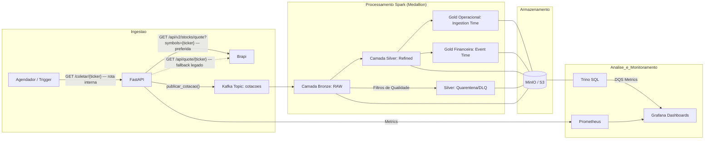

# Data Pipeline - Ingestão de Dados Ativos B3

Este projeto demonstra um pipeline de dados em near real time para cotações de ativos B3 utilizando a API da Brapi, Kafka, Spark Structured Streaming, Delta Lake, MinIO e Trino.

O processamento é contínuo, mas a latência de ponta a ponta depende também da fonte de dados. Durante o desenvolvimento será usada a Brapi Free, com dados defasados. Para a coleta final de evidências do TCC, a estratégia recomendada é contratar temporariamente a Brapi Pro, que reduz o atraso aproximado das cotações para 5 minutos.

---

## 🛠️ Requisitos e Tecnologias
- **Docker & Docker Compose**
- **Git Bash** (recomendado para Windows)
- **Tecnologias**: FastAPI, Kafka, Spark 3.5, Delta Lake, MinIO, Trino, Prometheus, Grafana.

---

## 🚀 Execução End-to-End (E2E)

Siga esta ordem exata para garantir que todas as camadas sejam criadas e fiquem visíveis no Trino e no Grafana. No Windows, use os equivalentes `.bat` (`start_pipeline.bat`, `register_trino_tables.bat`) ou o Git Bash.

1.  **Reset total (opcional; apaga dados persistidos):**
    ```bash
    cd app
    ./reset_pipeline.sh
    ```
    Use somente quando quiser descartar o ambiente de teste. Remove containers, volumes do MinIO/Kafka e metadados do Trino; nao execute antes de coletar evidencias que precisam ser preservadas.

    > ⚠️ **Obrigatório ao atualizar de uma versão anterior do layout** (ex.: Silver particionada por `data` em vez de `ano_mes_dia`, ou colunas renomeadas). Na inicialização, os jobs Silver e Quarentena comparam o esquema e o particionamento da tabela Delta existente com o layout atual. Se houver divergência, encerram com o log `delta_table_schema_incompatible`, listando as diferenças, em vez de falhar no meio do stream. Nesse caso, exporte as evidências necessárias e execute o reset.

2.  **Subida do pipeline:**
    ```bash
    ./start_pipeline.sh
    ```
    Sobe todos os serviços via Docker Compose, executa os testes Spark no container e abre o console do MinIO (porta 9001).

    > ⚠️ O script também sobe o `agendador`, que **inicia a coleta imediatamente** e consome quota da Brapi. Para uma coleta controlada (com horário de início/fim e captura de logs), siga o [Guia de evidências do TCC](app/GUIA_EVIDENCIAS_TCC.md) em vez deste passo.

3.  **Aguarde 5–7 minutos (tempo do Spark):**
    Os jobs Spark gravam no Data Lake com trigger de **5 minutos**, e cada camada só inicia após detectar a anterior (Bronze → Silver → Gold).
    *   Acesse o [MinIO](http://localhost:9001) (admin/admin123) e entre no bucket `datalake`.
    *   **Só prossiga quando** vir as pastas `bronze`, `silver` e `gold` contendo a subpasta `_delta_log`.

4.  **Registro no Trino:**
    ```bash
    ./register_trino_tables.sh
    ```
    Cria os schemas e registra as tabelas Delta, com novas tentativas automáticas caso os logs Delta ainda não existam.

5.  **Visualização:**
    Acesse o [Grafana](http://localhost:3001) (admin/admin) e abra o dashboard **`[TCC] Data Quality & Performance`**.
    *   O gráfico de **Ingestão** (Prometheus) aparece na hora. Os gráficos de **Qualidade e Latência** (Trino) aparecem após o passo 4.

---

## 🔔 Modelo de Coleta

**Atual — coleta acionada por trigger:** o serviço `agendador` (APScheduler) dispara, a cada `MARKET_DATA_POLL_INTERVAL_MINUTES`, uma chamada à rota interna da aplicação `GET /coletar/{ticker}` para cada ativo. Essa rota FastAPI não mudou. Ao receber a chamada, a API consulta primeiro a rota externa v2 da Brapi (`GET https://brapi.dev/api/v2/stocks/quote?symbols={ticker}`), normaliza e valida o payload e publica no Kafka. Se a chamada v2 falhar, tenta a rota legada da Brapi (`/api/quote/{ticker}`) como fallback. A exceção é o `404` (ticker sem cotação): nesse caso não há fallback, porque a rota legada responderia o mesmo. O token é enviado no header `Authorization: Bearer`, conforme a [documentação da Brapi](https://brapi.dev/docs/acoes/cotacao), e não aparece na URL nem nos logs.

Para evidência, os logs da API registram `endpoint_versao` (`v2` ou `v1_legado`) e `duracao_ms` em cada chamada, além do evento `brapi_fallback_legacy_endpoint` quando o fallback é acionado. O agendador coleta os tickers em paralelo (`MARKET_DATA_MAX_WORKERS`) e, ao fim de cada ciclo, registra `scheduler_cycle_finished` com `sucessos`, `falhas` e `duracao_ms`. Se o ciclo ultrapassar o intervalo configurado, registra `scheduler_cycle_overrun`.

**Evolução planejada — Webhooks/Notificações da Brapi:** em vez de consultar periodicamente, a Brapi notificará a API quando houver atualização. A API já isola o caminho de publicação em `publicar_cotacao()` (validação de schema + envio ao Kafka), de modo que um futuro endpoint `POST /webhook/brapi` reutiliza exatamente o mesmo fluxo até o Kafka, sem alterar as camadas Spark.

---

## 📊 Fluxo de Dados (Arquitetura Medallion)


```mermaid
graph LR
    subgraph Ingestao
        Agendador[Agendador / Trigger] -- "GET /coletar/{ticker} — rota interna" --> API[FastAPI]
        API -- "GET /api/v2/stocks/quote?symbols={ticker} — preferida" --> Brapi[Brapi]
        API -. "GET /api/quote/{ticker} — fallback legado" .-> Brapi
        API -- "publicar_cotacao()" --> Kafka[Kafka Topic: cotacoes]
    end

    subgraph "Processamento Spark (Medallion)"
        Kafka --> Bronze[Camada Bronze: RAW]
        Bronze --> Silver[Camada Silver: Refined]
        Bronze -- "Filtros de Qualidade" --> Quarentena[Silver: Quarentena/DLQ]
        Silver --> GoldOp[Gold Operacional: Ingestion Time]
        Silver --> GoldFin[Gold Financeira: Event Time]
    end

    subgraph Armazenamento
        Bronze & Silver & Quarentena & GoldOp & GoldFin --- MinIO[(MinIO / S3)]
    end

    subgraph Analise_e_Monitoramento
        MinIO --- Trino[Trino SQL]
        Trino -- "DQS Metrics" --> Grafana[Grafana Dashboards]
        API -- "Metrics" --> Prometheus[Prometheus]
        Prometheus --> Grafana
    end
```

---

## 🖥️ Dashboards de Monitoramento

Após iniciar o pipeline, você pode acompanhar o status operacional através destes links:

| Serviço | URL de Acesso | Objetivo |
| :--- | :--- | :--- |
| **Grafana** | [http://localhost:3001](http://localhost:3001) | **Dashboard Principal: Saúde e Qualidade (DQS)** |
| **Prometheus** | [http://localhost:9090](http://localhost:9090) | Consultar métricas HTTP da API (FastAPI). |
| **MinIO Console** | [http://localhost:9001](http://localhost:9001) | Verificar arquivos `.parquet` e logs Delta. |
| **Spark Master** | [http://localhost:8080](http://localhost:8080) | Acompanhar aplicações Spark "Running". |
| **FastAPI Docs** | [http://localhost:8000/docs](http://localhost:8000/docs) | Testar a ingestão manualmente. |

> **Credenciais Grafana:** Usuário `admin` / Senha `admin`. O dashboard **"[TCC] Data Quality & Performance"** já vem pré-configurado.

---

## 📈 Estratégia de Qualidade (Data Quality Score)

O dashboard do Grafana monitora continuamente três dimensões de qualidade na Silver:
1. **Validade**: percentual de registros com ticker preenchido e preço maior que zero.
2. **Completude**: percentual de registros com valor de mercado (`valor_mercado_total`, `marketCap` na Brapi) preenchido.
3. **Freshness operacional (Frescor)**: percentual de registros processados entre Kafka e Silver em até 660s. O SLA reflete o desenho do pipeline: 2 triggers de 5 minutos (Bronze e Silver) mais 60s de margem de processamento. O atraso herdado da fonte Brapi é medido separadamente, pois não é controlado pelo pipeline.

O **Data Quality Score (DQS)** global é a média dessas três dimensões. Duas métricas complementares ficam no relatório SQL: a integridade do parsing na Bronze (`status_parse_bronze`) e os rejeitados por motivo na quarentena.

---

## ⚙️ Configuração

Crie o arquivo `.env` em `app/` a partir do modelo. O Docker Compose o lê automaticamente:

```bash
cd app
cp .env.example .env
```

Preencha `BRAPI_TOKEN` com o token do seu plano. Ele é enviado à Brapi no header `Authorization: Bearer`. O `.env` está no `.gitignore`: **nunca o commite nem exiba o token em capturas de tela ou logs de evidência**. Sem token, as chamadas seguem sem autenticação, e o que fica disponível depende das regras e do plano da Brapi. As evidências finais devem registrar o plano usado e a limitação de atualização da fonte.

Principais configurações:

| Variável | Objetivo | Padrão |
| :--- | :--- | :--- |
| `BRAPI_TOKEN` | Token da Brapi Free/Pro. | vazio |
| `MARKET_DATA_POLL_INTERVAL_MINUTES` | Intervalo do agendador. | `5` |
| `MARKET_DATA_TICKERS` | Lista de ativos coletados, separada por vírgula. | `PETR4,VALE3,ITUB4,BBAS3,MGLU3,BBDC4,ABEV3,WEGE3,RENT3,SUZB3,B3SA3,VIVT3,EQTL3,LREN3,AXIA3` |
| `MARKET_DATA_API_TIMEOUT_SECONDS` | Timeout do agendador ao chamar a API. Deve superar o pior caso da API, ≈45s: Brapi v2 + fallback v1 (~10s cada) + Kafka (10s + 15s). | `60` |
| `MARKET_DATA_MAX_WORKERS` | Coletas simultâneas por ciclo do agendador. | `4` |
| `KAFKA_TOPIC` | Tópico Kafka usado pela API e pelo Spark Bronze. | `cotacoes` |
| `KAFKA_PRODUCER_RETRIES` | Tentativas de reenvio do producer Kafka. | `5` |
| `KAFKA_PRODUCER_RETRY_BACKOFF_MS` | Intervalo entre retentativas do producer Kafka. | `500` |
| `KAFKA_PRODUCER_LINGER_MS` | Pequena espera para batching do producer Kafka. | `50` |
| `LOG_LEVEL` | Nível dos logs estruturados da API, agendador e jobs Spark. | `INFO` |
| `MINIO_ACCESS_KEY` | Usuário do MinIO/S3 local. | `admin` |
| `MINIO_SECRET_KEY` | Senha do MinIO/S3 local. | `admin123` |
| `DATA_LAKE_BUCKET` | Bucket usado para Bronze, Silver, Gold e checkpoints. | `datalake` |

API FastAPI e agendador são serviços conteinerizados no `docker-compose.yml`. A API publica mensagens no Kafka usando `KAFKA_BOOTSTRAP_SERVERS=kafka:29092`, chaveia os eventos por ticker e aguarda confirmação do broker com `acks=all` e retentativas configuráveis. O agendador chama a API pela rede interna em `http://api:8000`.

Ao iniciar, o agendador executa uma primeira coleta imediatamente e depois segue o intervalo configurado em `MARKET_DATA_POLL_INTERVAL_MINUTES`. Isso reduz o tempo de espera durante demonstrações e coletas de evidência.

Antes da publicação no Kafka, a API valida o ticker (formato B3, ex.: `PETR4`, `BOVA11`, `^BVSP`; inválidos retornam `400`) e a estrutura da resposta da Brapi com modelos Pydantic. Essa validação funciona como governança de schema na borda de ingestão: respostas sem `results` ou fora do contrato esperado são rejeitadas com erro `502`, enquanto os valores de negócio inválidos continuam sendo tratados pelas regras de qualidade da Silver e pela quarentena. Os detalhes técnicos dos erros ficam nos logs; a resposta HTTP traz apenas uma mensagem genérica.

API, agendador e jobs Spark emitem logs estruturados em JSON por linha, com campos como `timestamp`, `service`, `event` e contexto operacional. Isso facilita coletar evidências de execução e prepara o projeto para integração futura com ferramentas como Prometheus/Grafana ou uma stack de logs.

---

## 🧪 Testes

Os testes ficam em `app/tests/` e seguem o padrão `testes_*.py` (configurado em `app/pytest.ini`).

```bash
cd app
# Lógica Spark (no container, que já tem Java/Spark)
docker compose run --rm --no-deps --user root spark-bronze /usr/bin/python3 -m pytest /app/tests/testes_logica_spark.py
# API e agendador
docker compose run --rm --no-deps api python -m pytest /app/tests/testes_validacao_api.py /app/tests/testes_agendador.py /app/tests/testes_compatibilidade.py
```

A execução local de `pytest` fora do Docker depende de uma instalação Java válida e da variável `JAVA_HOME`. Para evitar diferenças de ambiente, prefira os containers, como fazem o `start_pipeline.sh` e o CI.

---

## CI/CD e Política de Branches

O repositório usa GitHub Actions para reforçar o fluxo de entrega:

| Workflow | Gatilho | Função |
| :--- | :--- | :--- |
| `0-pr-policy.yml` | PR para `develop`/`main` | PRs para `develop` só de `feature/*`; PRs para `main` só de `develop`. |
| `1-feature-ci.yml` | push em `feature/**` e PR para `develop` | Testes PySpark e da API com cobertura, checagem sintática e scan Sonar. |
| `2-auto-pr-feature.yml` | criação/push de `feature/**` | Abre automaticamente PR `feature/*` → `develop` (se houver commits à frente). |
| `auto-pr-develop.yml` | push em `develop` | Abre automaticamente PR `develop` → `main` (se houver commits à frente). |
| `release-ci.yml` | PR `develop` → `main` | Validação reforçada: `docker compose config`, build de todas as imagens, testes com cobertura e Sonar. |

Falhas de teste reprovam o job. O scan Sonar (SonarCloud) só roda quando o secret `SONAR_TOKEN` está configurado e é não bloqueante; os relatórios `app/coverage-*.xml` alimentam a cobertura.

Importante: GitHub Actions consegue falhar checks, mas o bloqueio de merge deve ser configurado nas regras de proteção de branch do GitHub. Para garantir que nenhuma etapa seja pulada, configure os checks obrigatórios pelos nomes dos jobs: `Validate source and target branches`, `Spark and API checks` e `Full release validation`.

Para o PR automático funcionar, habilite em `Settings > Actions > General > Workflow permissions` a opção que permite escrita pelo `GITHUB_TOKEN`. Se essa permissão não estiver habilitada, o workflow registra o motivo e o PR deve ser criado manualmente.

---

## 🔍 Consultando Dados no Trino

Acesse o CLI do Trino (a partir de `app/`):

```bash
docker-compose exec trino trino
```

As tabelas precisam estar registradas: veja o passo 4 do E2E (`register_trino_tables.sh` ou `.bat`, obrigatório após cada reset). Comandos executados pelo script, para referência:

```sql
-- Criar os esquemas
CREATE SCHEMA IF NOT EXISTS delta.bronze;
CREATE SCHEMA IF NOT EXISTS delta.silver;
CREATE SCHEMA IF NOT EXISTS delta.gold;

-- Registrar as tabelas (Se falhar, aguarde os logs aparecerem no MinIO e repita)
CALL delta.system.register_table(schema_name => 'bronze', table_name => 'cotacoes', table_location => 's3a://datalake/bronze/cotacoes');
CALL delta.system.register_table(schema_name => 'silver', table_name => 'cotacoes', table_location => 's3a://datalake/silver/cotacoes');
CALL delta.system.register_table(schema_name => 'silver', table_name => 'cotacoes_rejeitadas', table_location => 's3a://datalake/silver/cotacoes_rejeitadas');
CALL delta.system.register_table(schema_name => 'gold', table_name => 'media_precos_ingestao_5min', table_location => 's3a://datalake/gold/media_precos_ingestao_5min');
CALL delta.system.register_table(schema_name => 'gold', table_name => 'media_precos_atualizacao_5min', table_location => 's3a://datalake/gold/media_precos_atualizacao_5min');
```

---

## Modelagem de Dados das Camadas

A modelagem segue a arquitetura Medallion, separando rastreabilidade, qualidade e consumo analítico.

| Camada | Tabela Trino | Finalidade | Tempo principal |
| :--- | :--- | :--- | :--- |
| Bronze | `delta.bronze.cotacoes` | Preservar payload bruto, metadados Kafka e resultado do parsing. | `data_hora_kafka` / `data_hora_ingestao` |
| Silver | `delta.silver.cotacoes` | Manter apenas cotações válidas, tipadas e deduplicadas. | `data_hora_atualizacao_valor` |
| Silver Rejeitados | `delta.silver.cotacoes_rejeitadas` | Auditar registros rejeitados pelas regras de qualidade. | `data_hora_ingestao` |
| Gold Operacional | `delta.gold.media_precos_ingestao_5min` | Medir comportamento operacional do pipeline por janela de ingestão. | `data_hora_ingestao` |
| Gold Financeira | `delta.gold.media_precos_atualizacao_5min` | Analisar preços por janela do horário real da cotação (evento). | `data_hora_atualizacao_valor` |

### Bronze: `delta.bronze.cotacoes`

Principais colunas:

- `topico_kafka`, `particao_kafka`, `offset_kafka`, `chave_kafka`: metadados de origem para rastreabilidade e replay.
- `data_hora_kafka`: timestamp atribuído pelo Kafka.
- `json_bruto`: payload bruto recebido da API.
- `status_parse_bronze`: status do parsing (`parse_ok`, `erro_parse`, `sem_resultado`).
- `data_hora_ingestao`: momento em que o Spark materializou o registro na Bronze.
- `symbol`, `regularMarketPrice`, `regularMarketTime`, `regularMarketChange`, `marketCap`: campos extraídos da resposta da Brapi quando o parsing é possível.

### Silver: `delta.silver.cotacoes`

Principais colunas:

- `ticket_ativo_b3`: ativo negociado, derivado de `symbol`.
- `valor_atual`: preço tipado como `double`.
- `moeda`: código da moeda (ex: "BRL").
- `variacao_valor_dia_anterior`: variação nominal.
- `valor_mercado_total`: valor de mercado informado pela fonte (`marketCap` na Brapi).
- `data_hora_atualizacao_valor`: horário real da cotação na Brapi.
- `ano_mes_dia`: data de particionamento da Silver (formato `yyyy-MM-dd`).
- `data_hora_kafka`, `data_hora_ingestao` e `data_hora_processamento_silver`: timestamps usados para cálculo de latência e auditoria.

Regras aplicadas:

- remove ticker nulo ou vazio;
- remove preço nulo, zero ou negativo;
- remove timestamp de evento inválido;
- remove registros sem `data_hora_ingestao`;
- deduplica por `ticket_ativo_b3`, `data_hora_atualizacao_valor` e `valor_atual`.

### Silver Rejeitados: `delta.silver.cotacoes_rejeitadas`

Esta tabela preserva registros que não passam nas regras de qualidade da Silver.

Principais colunas:

- metadados Kafka e `json_bruto`, para auditoria;
- campos brutos da cotação, quando disponíveis;
- `data_hora_atualizacao_valor` e `data_hora_ingestao`;
- `rejection_reason`: motivos traduzidos (ex: `ticket_invalido`, `valor_atual_invalido`).

### Gold Operacional: `delta.gold.media_precos_ingestao_5min`

Agrega a Silver por janelas de 5 minutos usando `data_hora_ingestao`.

Principais colunas:

- `inicio_periodo`, `fim_periodo`;
- `ticket_ativo_b3`;
- `preco_medio_periodo`, `preco_minimo_periodo`, `preco_maximo_periodo`;
- `quantidade_amostras`;
- `periodo_base = data_hora_ingestao`;
- `data_hora_processamento`.

### Gold Financeira: `delta.gold.media_precos_atualizacao_5min`

Agrega a Silver por janelas de 5 minutos usando `data_hora_atualizacao_valor`.

Principais colunas:

- `inicio_periodo`, `fim_periodo`;
- `ticket_ativo_b3`;
- `preco_medio_periodo`, `preco_minimo_periodo`, `preco_maximo_periodo`;
- `quantidade_amostras`;
- `periodo_base = data_hora_atualizacao_valor`;
- `data_hora_processamento`.

Uso principal: análise temporal dos preços pelo horário real da cotação.

---

## 📊 Relatórios e Métricas (Pasta `/queries`)

O diretório `app/queries/` contém os scripts necessários para extrair as evidências finais do seu TCC:

1.  **`relatorio_tcc_metricas.sql`**: relatório principal, com volume por camada, qualidade, latência por etapa (p50, p95 e p99), cobertura e gaps de coleta, DQS por ticker e agregados Gold. As consultas são parametrizadas pela data da coleta (`{{DATA_COLETA}}`, janela 09:45–18:00 BRT) e, por isso, **não devem ser coladas diretamente no Trino**. Gere o relatório em Markdown com:
    ```bash
    cd app
    bash ./exportar_relatorio_tcc.sh AAAA-MM-DD
    ```
    O resultado fica em `app/evidencias/queries/`. O script usa `queries/format_trino_markdown.py` para transformar as seções em títulos.
2.  **`metrics_analysis.py`**: catálogo de queries para exploração manual (inclui janelas das últimas 24 horas). Ao ser executado, apenas **imprime** as queries para copiar no CLI do Trino.

---

## 📈 Configurações para TCC (Alta Estabilidade)
O ambiente foi configurado para suportar execuções longas (24h+):
- **Spark Worker**: 6GB RAM.
- **Spark Worker Cores**: 5 cores para manter Bronze, Silver, Quarentena, Gold Operacional e Gold Financeira em execução simultânea.
- **Drivers/Executors**: 1GB RAM por camada.
- **Persistência**: Checkpoints automáticos no MinIO para recuperação de falhas.

---

## 🎓 Estratégia de Defesa no TCC

Para manter a defesa tecnicamente correta, o trabalho deve usar a expressão **near real time** em vez de tempo real estrito. A arquitetura processa eventos de forma contínua, mas a atualização do preço depende da Brapi.

Plano adotado:

1. **Desenvolvimento com Brapi Free**: manter o custo zero enquanto o pipeline, os testes e a documentação são estabilizados.
2. **Coleta final com Brapi Pro**: contratar por um mês próximo da apresentação para coletar evidências com atraso aproximado de 5 minutos.
3. **Duas Golds em janelas de 5 minutos**: separar a Gold Operacional, baseada em `data_hora_ingestao`, da Gold Financeira, baseada em `data_hora_atualizacao_valor`. A primeira mede comportamento do pipeline por intervalo de ingestão; a segunda representa a análise temporal da cotação pelo horário real informado pela Brapi. As escritas das Golds usam modo `complete` para materializar os agregados atuais durante a demonstração.
4. **Medição de latência fim a fim**: separar latência da fonte, latência de ingestão e latência de processamento entre Bronze, Silver e Gold (utilizando percentis p50, p95 e p99 para análise de cauda).
5. **Quarentena de dados rejeitados**: manter em `silver.cotacoes_rejeitadas` os registros que não atendem às regras de qualidade da Silver, com o motivo de rejeição traduzido.
6. **Trabalhos futuros**: como próxima evolução, integrar webhooks/notificações da Brapi, aproveitando o `publicar_cotacao()` já isolado (ver [Modelo de Coleta](#-modelo-de-coleta)). Como evolução para dados efetivamente em tempo real, integrar Market Data via WebSocket (ex.: Cedro). Nenhuma das duas fica no caminho crítico da entrega.

Essa escolha reduz risco operacional na apresentação e mantém uma justificativa sólida de Engenharia de Dados: a arquitetura é streaming, enquanto a tempestividade dos dados é limitada pelo provedor contratado.

---

## Limitações Arquiteturais Assumidas

Este projeto foi desenhado como um ambiente local reprodutível para TCC, não como uma implantação produtiva de alta disponibilidade. As principais limitações assumidas são:

- **Kafka local com baixa redundância**: o ambiente usa uma única instância local, adequada para demonstração, mas sem tolerância real a falhas.
- **MinIO local**: simula armazenamento compatível com S3, mas não substitui políticas produtivas de backup, replicação e controle de acesso.
- **Orquestração simplificada**: Docker Compose e scripts shell garantem reprodutibilidade local; em produção, um orquestrador como Airflow, Prefect ou Dagster seria mais adequado para retries, lineage e monitoramento.
- **Fonte de dados limitada pelo provedor**: a arquitetura processa continuamente, mas a atualização das cotações depende do plano contratado na Brapi.
- **Separação entre tempo operacional e tempo financeiro**: a Gold Operacional usa `data_hora_ingestao` para medir o pipeline, enquanto a Gold Financeira usa `data_hora_atualizacao_valor` para análise de mercado.
- **Ambiente Single-Node**: Desenhado para execução em uma única máquina (Docker), não escalado horizontalmente para clusters produtivos.

Essas limitações devem ser apresentadas como decisões de escopo para manter o foco do TCC em arquitetura lakehouse, streaming e mensuração de latência.

---

## Checklist de Evidências para Defesa

Antes da apresentação, recomenda-se executar uma coleta controlada e registrar os itens abaixo. O passo a passo (comandos, captura de logs e ordem das queries) está no [Guia de evidências do TCC](app/GUIA_EVIDENCIAS_TCC.md).

1. **Subida do ambiente**: containers ativos no Docker Compose, API saudável e Spark jobs em execução.
2. **Criação das camadas Delta**: pastas Bronze, Silver e Gold no MinIO com `_delta_log`.
3. **Registro no Trino**: schemas `delta.bronze`, `delta.silver` e `delta.gold` consultáveis.
4. **Volume por camada**: contagem de registros em Bronze, Silver e Gold (seção 01 do relatório gerado por `exportar_relatorio_tcc.sh`).
5. **Qualidade de dados**: quantidade de registros válidos, inválidos filtrados e duplicidades removidas.
6. **Quarentena**: contagem de rejeitados por `rejection_reason` em `delta.silver.cotacoes_rejeitadas`.
7. **Latência por etapa**: diferença entre `data_hora_atualizacao_valor`, `data_hora_kafka` e `data_hora_processamento_silver`.
8. **Throughput**: registros processados por minuto na camada Silver.
9. **Particionamento**: distribuição física da Silver por `ticket_ativo_b3` e `ano_mes_dia`.
10. **Agregados Gold**: médias, mínimos, máximos e amostras por janela de 5 minutos nas Golds operacional e financeira.
11. **Limitação da fonte**: evidência do plano Brapi usado e explicação do impacto na latência fim a fim.

---

## 📎 Evidências e Anexos do TCC

| Material | Onde | Conteúdo |
| :--- | :--- | :--- |
| Roteiro de coleta | [`app/GUIA_EVIDENCIAS_TCC.md`](app/GUIA_EVIDENCIAS_TCC.md) | Preparação, início/fim da coleta, captura de logs, exportação e interpretação do relatório. |
| Relatório de métricas | `app/exportar_relatorio_tcc.sh` → `app/evidencias/queries/` | Resultado das queries Trino em Markdown para a data da coleta. |
| Logs da sessão | `app/evidencias/logs/` | Logs JSON da API, agendador, Kafka e Spark (pasta fora do git). |
| Site de anexos | [`docs/`](docs/), publicado em https://suzyguebata.github.io/cotacao_bolsa/ | Página do projeto com arquitetura, capturas (`docs/assets/evidencias/`) e o vídeo de demonstração. |
| Vídeo | YouTube (não listado), incorporado no site | Demonstração da execução do pipeline. Não versionar o arquivo de vídeo no git. |

> Revise logs e capturas antes de publicar: **nunca inclua o `.env`, o token da Brapi ou outras credenciais**.

---

*Documentação organizada para suporte ao TCC e apresentações técnicas.*
